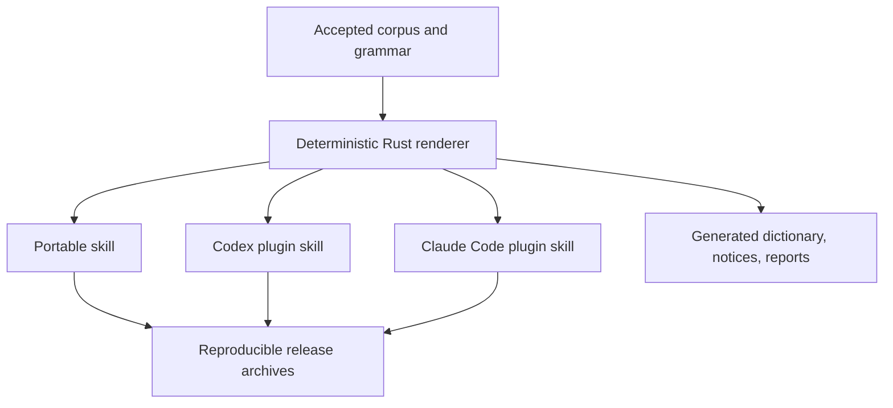

# Toen

[](https://github.com/airscripts/toen/actions/workflows/main.yml)
[](LICENSE)
[](docs/methodology.md)

Toen is a compact, source-grounded Livornese skill for assistants. It changes
visible replies, status updates, and tool narration when explicitly activated;
it preserves technical literals and never controls hidden reasoning.

Toen is text-only, explicit-only, and local. It has no service, account,
telemetry, hook, MCP server, or model-calling runtime. The repository provides
one portable skill plus certified Codex and Claude Code integrations.

## Contents

- [Why Toen Exists](#why-toen-exists)
- [Choose A Distribution](#choose-a-distribution)
- [Install](#install)
- [Quick Start](#quick-start)
- [Protected Text And Session State](#protected-text-and-session-state)
- [Architecture](#architecture)
- [Repository Map](#repository-map)
- [Corpus And Licensing](#corpus-and-licensing)
- [Toenizer](#toenizer)
- [Maintainer Setup](#maintainer-setup)
- [Platform Support](#platform-support)
- [Release Artifacts](#release-artifacts)
- [Privacy And Security](#privacy-and-security)
- [Support And Contribution](#support-and-contribution)
- [Citation And Acknowledgements](#citation-and-acknowledgements)
- [License](#license)

## Why Toen Exists

Livornese can make ordinary assistant prose shorter and more local without
changing a requested deliverable. Toen documents a small contemporary runtime
core, separates readable Ammodino from denser Arranda, and keeps source-backed
forms in an accepted corpus.

Toen does not translate protected literals, invent unsupported forms, promise a
provider-specific token reduction, or replace a host's safety and language
requirements. The style is optional and can be turned off at any time.

## Choose A Distribution

| Distribution | Use It When | Activation |
| --- | --- | --- |
| Portable Skill | Your assistant accepts Markdown skills or custom instructions. | `$toen ...` |
| Codex Plugin | You want Codex marketplace installation and session metadata. | `$toen ...` |
| Claude Code Plugin | You want a namespaced Claude Code skill. | `/toen:toen [command] [task]` |

The three skill bodies are generated from the same corpus and grammar renderer.
Only host frontmatter and invocation metadata differ.

## Install

### Portable Skill

Clone the public repository, then copy [skill/toen/SKILL.md](skill/toen/SKILL.md)
into the skill or custom-instructions directory supported by your assistant.
The portable distribution also includes its README and attribution files.

### Codex Plugin

The project is currently installed from its public repository marketplace rather
than an official hosted marketplace:

```bash
git clone https://github.com/airscripts/toen.git
cd toen
codex plugin marketplace add .
codex plugin add toen --marketplace toen
```

Start a new session after installation. Installation does not activate Toen.
The distributable plugin is [plugins/codex/toen](plugins/codex/toen).

### Claude Code Plugin

Install from the repository marketplace:

```bash
git clone https://github.com/airscripts/toen.git
cd toen
claude plugin marketplace add .
claude plugin install toen@toen
```

Validate the checkout before installation with `claude plugin validate .`.
Invoke the installed skill explicitly as `/toen:toen ammodino` or
`/toen:toen arranda`.

## Quick Start

Portable and Codex commands:

```text
$toen
$toen ammodino
$toen arranda
$toen de
$toen spengi
$toen ammodino explain this error
$toen spengi summarize this normally
```

`ammodino` is readable and concise. `arranda` is denser and more local-first.
`de` reports the state; prose uses the Livornese interjection `dé`. Claude Code
uses the same command protocol after its namespaced explicit invocation.

## Protected Text And Session State

Toen applies only to visible assistant output. Preserve code, commands, paths,
URLs, IDs, logs, errors, quotes, numbers, and requested output formats exactly.
Technical terms remain standard unless the user explicitly asks otherwise.

New sessions start `spento`. Activation is conversation-local; supported resume
and compaction flows retain the selected mode. `$toen de` reports state, and
`$toen spengi` disables the style. Unknown commands show usage without changing
state. Host safety rules and explicit deliverable requirements always win.

## Architecture



`toenctl` discovers the workspace, validates source metadata and corpus
relationships, renders generated files atomically, runs the local Toenizer, and
packages self-contained distributions. CI uses only non-spending benchmark
checks; live benchmark campaigns are explicit maintainer commands and invoke
the configured model provider.

## Repository Map

| Path | Responsibility |
| --- | --- |
| `skill/toen/` | Host-neutral generated skill distribution. |
| `plugins/codex/toen/` | Self-contained Codex plugin. |
| `plugins/claude-code/toen/` | Self-contained Claude Code plugin. |
| `corpus/accepted/` | One TOML file per accepted linguistic record. |
| `corpus/sources.toml` | Bibliography and local-attestation metadata. |
| `toenctl/` | Rust 2024 validation, generation, Toenizer, and packaging. |
| `docs/` | Product, maintainer, corpus, and generated documentation. |
| `.github/workflows/` | Pinned cross-platform verification and release automation. |

## Corpus And Licensing

The accepted corpus contains exactly 500 reviewed records. Each record carries
stable identity, linguistic metadata, original examples, evidence locators, and
review information. Livorno-specific attestation is required; source pages are
never copied into the repository. See [Corpus Methodology](docs/methodology.md)
and [Corpus Authoring](docs/corpus-authoring.md).

Rust code, plugin metadata, and skill instructions are MIT-licensed. Original
corpus records and generated linguistic documentation are CC BY 4.0. Each
distribution carries the software license, corpus license, and source notice.

## Toenizer

Toenizer is a deterministic local estimator using the disclosed `o200k-base`
engine. It counts exact input, reports UTF-8 bytes and lines, and does not claim
provider usage or billing:

```bash
cargo toen toenizer count --text "Ciao, dé!"
cargo toen toenizer count --file path/to/text.md --format json
cargo toen toenizer compare --baseline "Italian text" --candidate "Testo livornese"
cargo toen toenizer report
cargo toen toenizer report --check
```

Comparison reports signed token differences and `Estimated Saving`, including
negative values as increases. A zero-token baseline is `n/a` in human output
and `null` in JSON. Read [Tokenization Methodology](docs/tokenization.md) and
the generated [Toenizer Report](docs/toenizer-report.md) for limitations.

## Maintainer Setup

Install Rust 1.89 from `rust-toolchain.toml`, clone the repository, and enter
it before running the portable Cargo alias:

```bash
git clone https://github.com/airscripts/toen.git
cd toen
cargo toen verify
cargo toen test
```

The same gates are exposed as `make verify` and `make test`; Lefthook runs only
those two targets before a commit. Use `cargo toen doctor` to inspect workspace
discovery, platform details, optional tools, and the command for checking
generated-file status.

## Platform Support

| Platform | Architecture | Coverage |
| --- | --- | --- |
| Ubuntu 24.04 Container | x86-64 | Full verification, coverage, packaging. |
| Windows 2025 | x86-64 | Build, tests, generation, manifests. |
| macOS 15 Intel | x86-64 | Build, tests, generation, manifests. |
| Ubuntu 24.04 ARM | ARM64 | Build, tests, generation, manifests. |
| macOS 15 | ARM64 | Build, tests, generation, manifests. |

CI performs no live source-link verification, live benchmark campaign, or
assistant invocation. The committed smoke manifest is still checked.

## Release Artifacts

`cargo toen package --version 0.1.0` requires reviewed benchmark evidence and
produces exactly:

```text
toen-skill-v0.1.0.zip
toen-codex-plugin-v0.1.0.zip
toen-claude-code-plugin-v0.1.0.zip
toen-benchmark-evidence-v0.1.0.zip
toen-benchmark-report-v0.1.0.md
toen-v0.1.0-checksums.txt
```

The archives have stable lexical entries, fixed timestamps, normalized text,
no repository metadata or build output, and self-contained licenses and source
notices. Checksums are lowercase SHA-256 lines sorted by filename. See
[Release Runbook](docs/release.md).

## Privacy And Security

Toen has no service, account, telemetry, dynamic vocabulary fetch, hook, or MCP
server. Source-link checks are explicit and use the local Rust HTTP client. CI
never sends prompts to an assistant or spends model tokens. Report security
issues privately as described in [SECURITY.md](SECURITY.md).

## Support And Contribution

See [SUPPORT.md](SUPPORT.md) for supported versions and help channels. Read
[CONTRIBUTING.md](CONTRIBUTING.md) before changing code or corpus records.

## Citation And Acknowledgements

Citation metadata is in [CITATION.cff](CITATION.cff). Thanks to Dario Moccia
for inspiring this project.

## License

See [LICENSE](LICENSE), [CORPUS-LICENSE.md](CORPUS-LICENSE.md), and the
generated [Source Notice](docs/source-notice.md).
