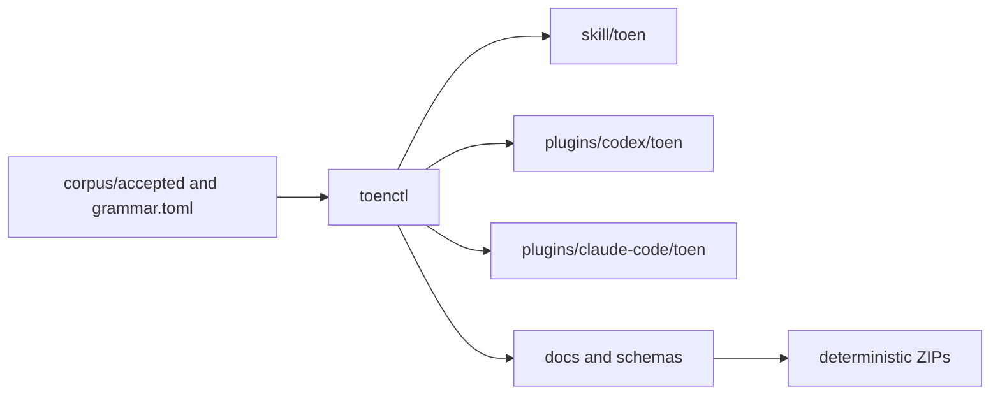

# Architecture

Toen has one linguistic source of truth and three generated distributions.

`toenctl` discovers the workspace, validates typed corpus relationships,
renders the canonical skill and host frontmatter, estimates sizes locally, and
writes generated files through temporary files followed by rename. Every host
package is self-contained because installed plugins cannot rely on repository
paths outside their archive.

The host integrations differ only at the boundary: Codex exposes `$toen` and
its explicit invocation policy, while Claude Code exposes the namespaced
`/toen:toen` skill with `disable-model-invocation: true`.
