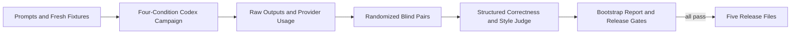

# Benchmarks

The release protocol compares normal Italian, explicitly terse Italian, Toen
Ammodino, and Toen Arranda on `gpt-5.6-sol` and `gpt-5.6-luna` with medium
reasoning. A campaign has 54 single-turn scenarios, six scripted ten-turn
sessions, and three repetitions. The scenarios are balanced 18/18/18 across
English, Italian, and Livornese. The two sessions in each language bring the
complete input set to exactly 20 English, 20 Italian, and 20 Livornese cases.

## Development Smoke Suite

The smoke suite uses the first 12 scenarios, every condition, one repetition,
and `gpt-5.6-luna`:

```bash
# Non-spending validation used by CI:
toenctl bench smoke --check

# Live campaign; invokes Codex and spends tokens:
toenctl bench smoke
```

Every live call prints campaign position, turn position, Codex event types, and
stderr as it runs. Raw JSONL-derived outputs and provider usage are retained in
the campaign directory.

## Release Campaign

Run the stages manually from an isolated maintainer environment:

```bash
toenctl bench run --release 0.1.0 --resume
toenctl bench judge --release 0.1.0
toenctl bench report --release 0.1.0
toenctl package --version 0.1.0
```

`--resume` skips complete results and continues partial ten-turn sessions.
Implementation scenarios copy a fixture into a fresh attempt directory,
initialize an isolated Git repository, and run its declared test command after
Codex finishes. User configuration and execution rules are ignored. The
internal `HarnessAdapter` boundary has only a Codex implementation in v0.1.



## Measurements and Evidence

Provider-reported input and output usage is stored exactly and drives the
ten-turn total-token break-even measurement. Visible output is measured
separately: all visible agent messages are joined in order and counted with
`o200k_base`. This keeps the visible-output gate distinct from hidden or
non-visible model work.

The evidence set includes exact model IDs, Codex version, medium-reasoning
configuration, prompts, fixtures, raw outputs, provider usage, randomized
judge inputs, hidden side mappings, schemas, rubrics, compatibility transcripts,
judge results, and Markdown/JSON reports. The package command rejects missing,
duplicate, stale-version, malformed, or incomplete campaign grids.

Completed evidence under `benchmarks/releases/<version>/` must be reviewed for
credentials, personal data, and unrelated content, then committed before the
release tag is created. The tag pipeline packages that exact versioned evidence;
temporary fixture work directories are excluded from the archive.

Blind judging covers all 54 single-turn replies and every turn of all six
sessions for each target mode, model, and repetition. Session judge inputs
include the user-turn history through the reply being assessed.

## Release Gates

Each Toen mode must pass on each model:

- Paired median visible-output reduction is at least 15% versus normal Italian,
  with a deterministic 10,000-sample bootstrap 95% interval above zero.
- Median cumulative provider input plus output breaks even by turn ten.
- The report always discloses the comparison with terse Italian.
- The lower 95% correctness bound versus terse Italian is at least `-0.2` on
  the 0–4 blind rubric.
- Fixture pass rates are at least those of terse Italian.
- Protected literals are preserved in every applicable reply.
- At least 90% of target replies score 3/4 or better for source-grounded style.
- No target reply receives a productive-slur or hidden-reasoning violation.
- All ten command/session checks pass on both models, including actual resume
  and a detected forced-compaction event.

CI validates the smoke manifest, schemas, code, and saved repository metadata;
it never runs live campaigns or judges.
