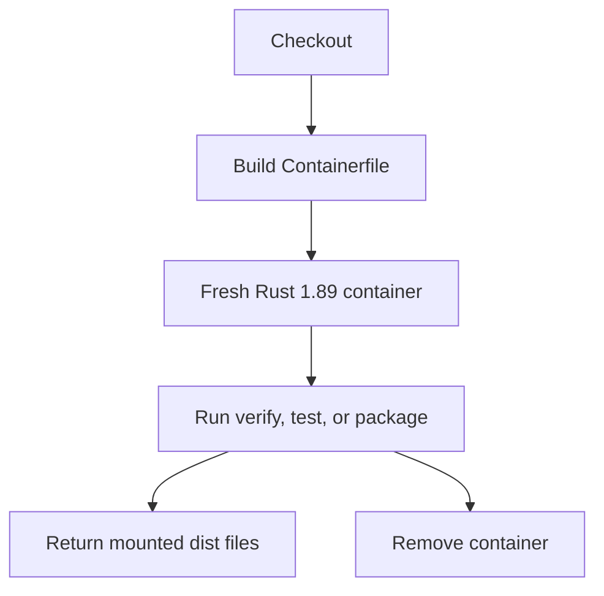

# Containers

Toen supports disposable container runs for the Linux maintainer workflow. The
container provides Rust 1.89 and validation tools; end users do not need a
container to use the skill.

## Local Use

```bash
make container-verify
make container-test
make container-package VERSION=0.1.0
```

`container-package` mounts `dist/` read-write and tracked benchmark release
evidence read-only so generated release files can be collected after the
disposable container exits. No source pages,
credentials, caches, model outputs, or build output are copied into the image.

## Runtime Boundary

`Containerfile` starts from a pinned `rust:1.89-bookworm` image digest and
installs Rust formatting, lint, and LLVM coverage components plus the small
validation tool set. `.dockerignore` excludes Git metadata, build output, and
release output.



Linux CI uses the same Rust container boundary. Native Windows, macOS Intel,
Linux ARM64, and macOS ARM64 jobs cover platform-specific behavior.
