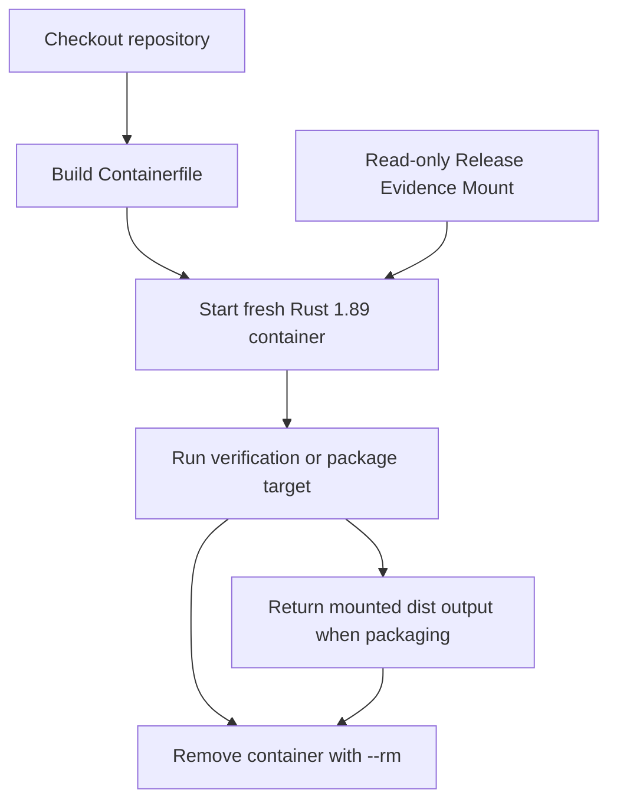

# Container Workflow

Toen supports disposable container runs for the Linux maintainer workflow.
This gives local development and CI a defined Rust runtime without changing
the plugin's end-user model: Toen remains a Codex skill with no service,
daemon, or container requirement.

## Local Use

Install Docker or a compatible command-line engine, then run:

```bash
make container-verify
make container-test
make container-package VERSION=0.1.0
```

`container-verify` builds the image and runs the complete repository gate.
`container-test` runs the Rust workspace unit and integration tests and
enforces at least 81% line coverage. `container-package` mounts the host
`dist/` directory read-write and `benchmarks/releases/` read-only. The
deterministic archives and checksums remain available after the disposable
container exits, while model output never becomes an image layer. Packaging
requires a complete passing benchmark evidence set for the requested version.

The defaults are configurable:

```bash
make container-verify CONTAINER_ENGINE=podman CONTAINER_IMAGE=toen-ci:local
```

The package target uses a host-directory bind mount and therefore expects a
Unix-like shell when run through Make. Direct `cargo` or host-native Make
targets remain available on systems without a container engine.

## Runtime Boundary

`Containerfile` starts from a pinned `rust:1.89-bookworm` image digest,
installs the Rust formatting, lint, and LLVM coverage components plus the small
set of validation tools, including `cargo-llvm-cov` 0.8.7, and runs from
`/workspace`. The image includes `.agents/` because manifest validation checks
the repository marketplace. It excludes build output, release output, Git
metadata, and workflow files through `.dockerignore`.



Every local container target uses `--rm`; CI also creates a new job container
for each Linux job. No container state, credentials, source pages, model
outputs, or benchmark tokens are retained by the workflow. CI never runs live
benchmark campaigns.

## CI Coverage

Linux verification, tests, release builds, and release packaging run inside
Rust 1.89 Bookworm job containers. macOS and Windows jobs remain native to
cover platform-specific path, archive, and process behavior. The dedicated
Container workflow builds the checked-in image and runs `make verify` in a
fresh disposable container. The Linux test job also enforces the current line
coverage floor of 81% and uploads the HTML report.
