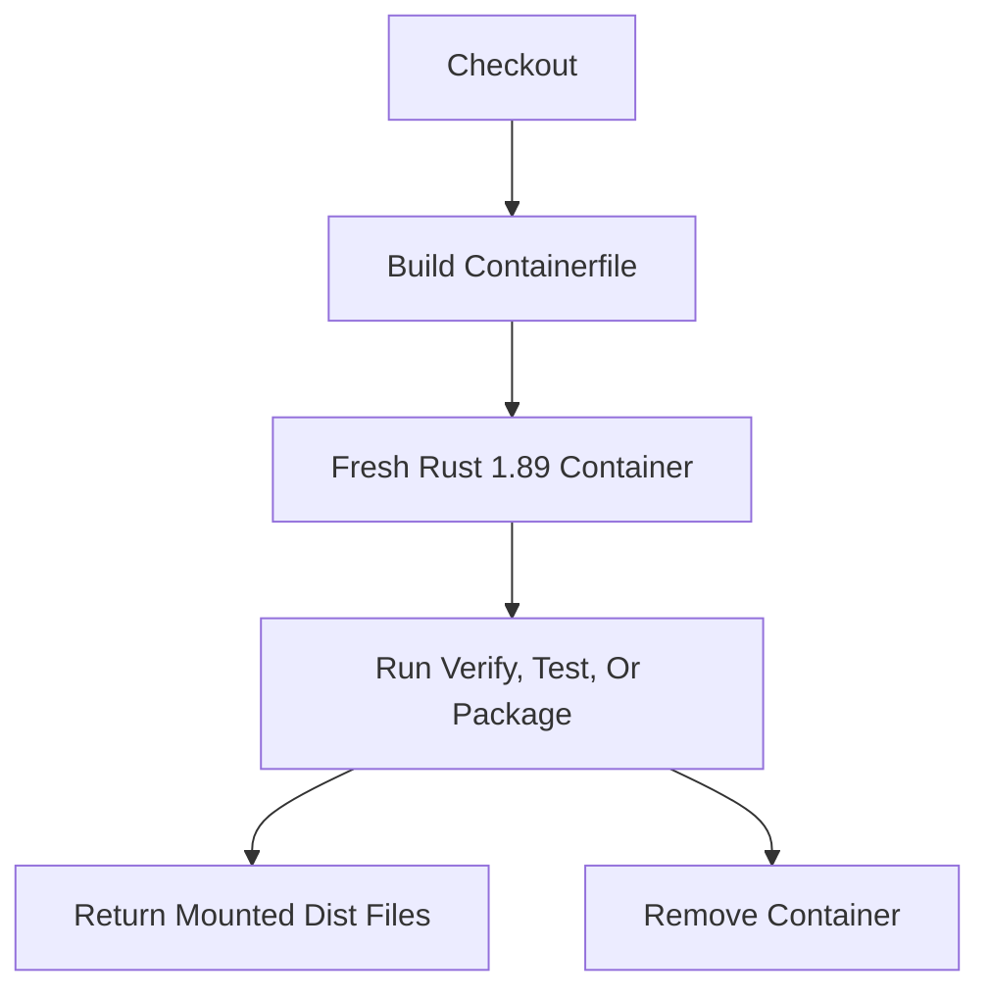

# Containers

Toen supports disposable container runs for the maintainer workflow. The
container provides Rust 1.89 and validation tools; end users do not need a
container to use the skill.

## Local Use

```bash
make -f Makefile.container verify
make -f Makefile.container test
make -f Makefile.container package VERSION=0.1.0
```

`Makefile.container` delegates its operations to the reusable functions in
`scripts/container/common.sh` through the `scripts/container/commands.sh`
dispatcher. The same functions can be sourced by another maintainer script
when a different container workflow needs the shared build, verification, test,
or package behavior.

`Makefile.container package` mounts `dist/` read-write so generated release
files can be collected after the disposable container exits. If matching
benchmark evidence exists, it is mounted read-only and must pass the same gates
as native packaging. No source pages, credentials, caches, model outputs, or
build output are copied into the image.

## Runtime Boundary

`Containerfile` starts from a pinned `rust:1.89-bookworm` image digest and
installs Rust formatting, lint, rust-analyzer, and LLVM coverage components
plus the small validation tool set. `.dockerignore` excludes Git metadata,
build output, and release output.



CI uses the same Rust container boundary. Native Windows x86-64, Windows
ARM64, macOS x86-64, Linux x86-64, Linux ARM64, and macOS ARM64 jobs cover
platform-specific behavior.
